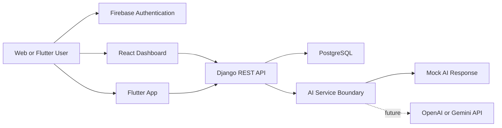

# Architecture

## Backend

Django REST Framework owns profiles, resumes, interview sessions, AI feedback, skill progress, and exam content. Firebase bearer token verification is isolated in `career/authentication.py`.

## Frontend

The React dashboard is a recruiter-friendly MVP interface for demoing the product. It currently uses local UI data and is ready to connect to the DRF endpoints.

## Mobile

The Flutter app mirrors the main user workflow: login, dashboard, resume upload placeholder, interview questions, and profile.

## AI Boundary

`career/services.py` accepts resume text, target role, and user skills. It returns resume score, strengths, weaknesses, missing skills, suggested improvements, and interview questions.
